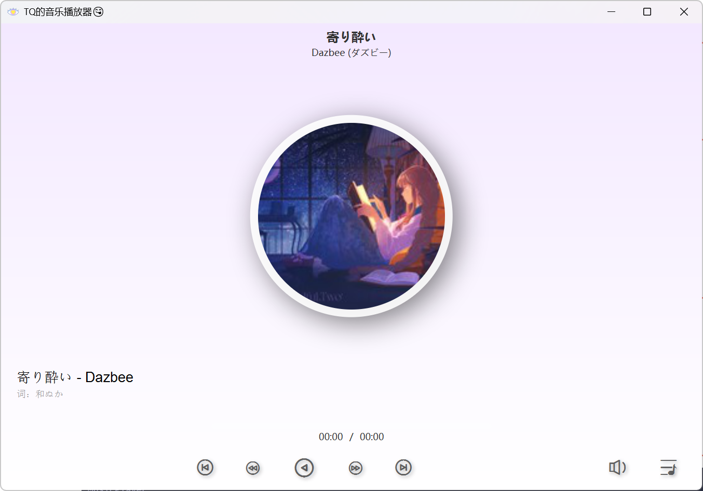
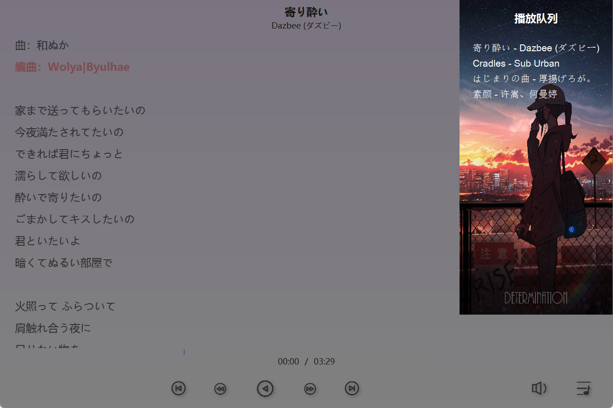
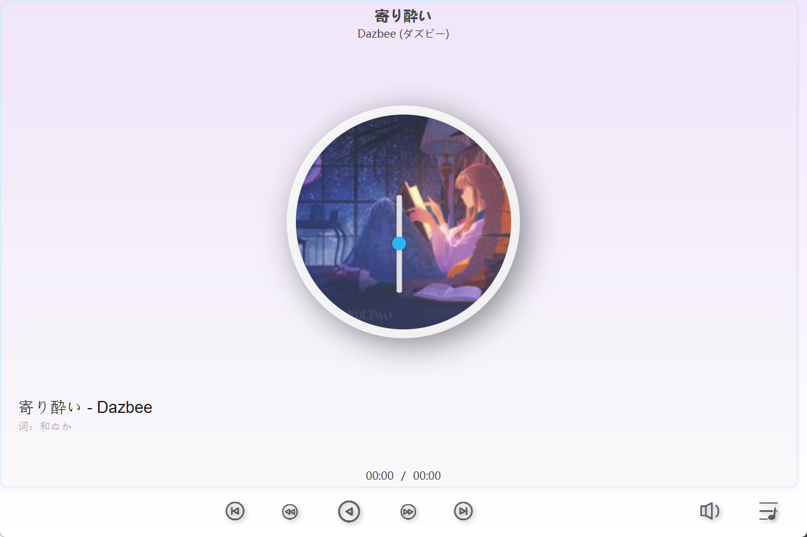
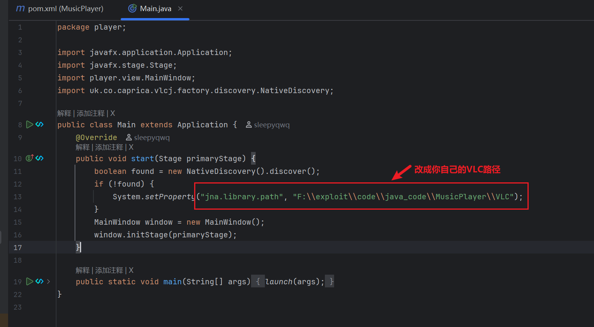
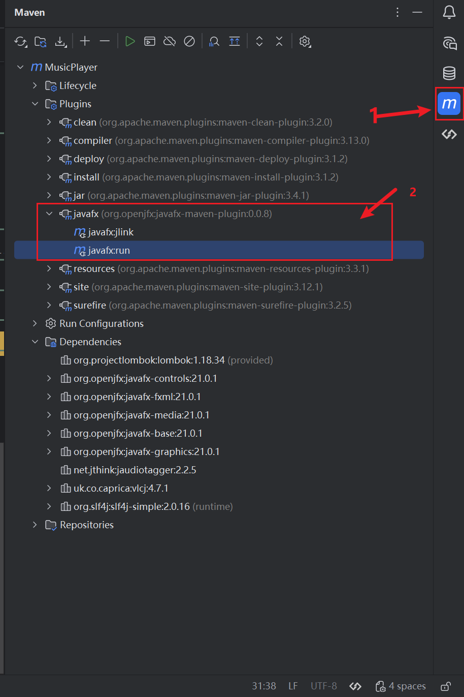
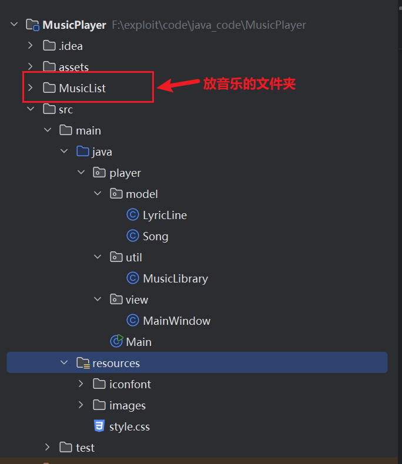
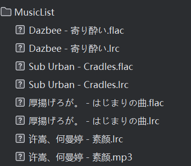

# 本地音乐播放器

## MusicPlayer 项目说明

本项目为基于 JavaFX 与 vlcj 的本地音乐播放器，支持扫描本地目录、读取音频标签与封面、显示 LRC 歌词、提供播放控制与动效界面。

## 基本的成果展示

1.主页面，也就是歌词的局部展示模式



2.所有的按钮都是动态交互的，也就是使用了交互式按钮

3.全局展示歌词，歌词是可以根据音乐同步移动追踪的


4.歌单列表，自动导入MusiList中的歌单



5.音量可以调节：



## 运行环境

JDK 21 及以上
Maven 3.8 及以上
操作系统建议为 64 位 Windows
本机需安装 64 位 VLC 3.x，并确保与 JDK 位数一致（项目中已经包含了VLC）

## 使用说明

1.使用idea打开项目

2.更新pom文件

3.请自行maven版本，Runner中jdk版本，Compiler中java版本

4.重点！请将Main文件中的VlC路径更改



## 快速启动

方式一 使用 Maven 直接运行
在项目根目录执行

```
mvn clean javafx:run
```

方式二 在 IntelliJ IDEA 使用 Application 运行

使用 `javafx-maven-plugin`，在 Maven 面板运行 `javafx:run`



## 主要技术

JavaFX 控件与动画
vlcj 调用本机 LibVLC 播放多媒体
jaudiotagger 解析音频元数据与封面
纯 Java 实现 LRC 歌词解析与滚动高亮

## 项目结构

```
MusicPlayer
├─ MusicList                  本地音乐文件夹（mp3 wav flac 及同名 .lrc）
├─ src
│  └─ main
│     ├─ java
│     │  └─ player
│     │     ├─ Main.java
│     │     ├─ model
│     │     │  ├─ Song.java
│     │     │  └─ LyricLine.java
│     │     ├─ util
│     │     │  └─ MusicLibrary.java
│     │     └─ view
│     │        └─ MainWindow.java
│     └─ resources
│        ├─ images            默认封面等资源（disc.png icon.png list.png…）
│        ├─ iconfont          字体图标文件
│        └─ style.css         界面样式
└─ pom.xml
```

## 媒体与歌词

MusicList 目录下放置音频文件
优先读取音频标签的标题与艺术家信息
封面从标签内 Artwork 读取，不存在则使用默认 `images/disc.png`
歌词支持同名 `.lrc` 文件，解析时间戳并按时间高亮与滚动



## 核心交互

播放暂停、上一曲、下一曲、快退与快进
局部歌词与全屏歌词视图切换，并带有动效
播放列表侧边浮层，双击条目切歌
音量浮层控制
唱片封面旋转与切换动画

## 常见问题

启动时报 `Module javafx.controls not found`
未配置 JavaFX 模块路径时会出现。解决方法是在 VM 选项添加 `--module-path` 与 `--add-modules`，或使用 `javafx-maven-plugin` 运行

运行时报 `Unable to load library 'libvlc'`
VLC 未安装或位数不匹配，或 `jna.library.path` 未指向包含 `libvlc.dll` 的目录。确认 JDK 与 VLC 同为 64 位，并正确设置路径

资源加载报错或图标不显示
检查 `resources` 是否在 classpath，路径使用 `getResource("/...")`，不要遗漏前导斜杠

## 目录与命名约定

音频与歌词文件名尽量保持“艺术家 - 标题”或“标题”规则
同名 `.lrc` 与音频文件位于同一目录



资源命名统一小写与短横线分隔，便于维护